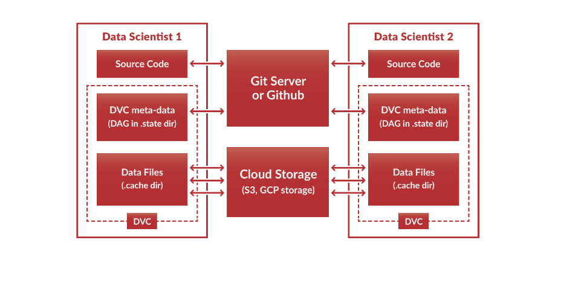
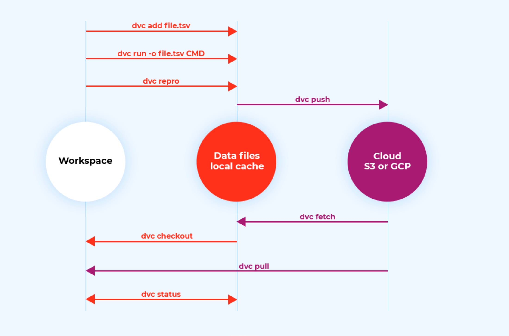
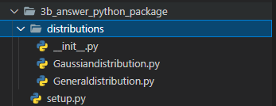
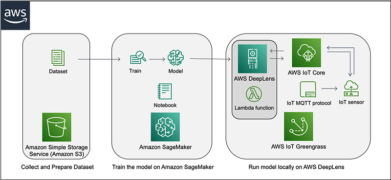

# Software engineer

## version control data science

- https://algorithmia.com/blog/how-to-version-control-your-production-machine-learning-models and https://becominghuman.ai/how-to-version-control-your-machine-learning-task-ii-d37da60ef570
- https://towardsdatascience.com/version-control-ml-model-4adb2db5f87c

## viết code hiệu quả
- nên dành tgian để refactor lại code
- viết docstring cho function, class, module, project:
    - Google Style Python Docstrings: https://sphinxcontrib-napoleon.readthedocs.io/en/latest/example_google.html
    - hdan viết readme cho project: https://classroom.udacity.com/courses/ud777
- nên viết test trước khi viết function => func có thể dùng pytest, class dùng unittest: https://docs.python-guide.org/writing/tests/
    - vd dùng unittest cho class: https://github.com/udacity/DSND_Term2/blob/master/lessons/ObjectOrientedProgramming/JupyterNotebooks/5.OOP_code_inheritance_clothing/inheritance_exercise_clothing.ipynb
    - vd test cho method ko return value (fit trong sklearn): https://github.com/scikit-learn/scikit-learn/blob/main/sklearn/linear_model/tests/test_base.py

- sử dụng logging thay vì print
- sử dụng OOP

- mình bổ sung 1 ý khi xem source sklearn: mình nhớ thực hiện import trong function (python) sẽ tốn ít tài nguyên hơn: https://github.com/scikit-learn/scikit-learn/blob/6c566da8c99b4908a549aeb659cd4b1124bc2448/sklearn/__init__.py#L135

## Making a package

- basic package (https://www.youtube.com/watch?v=Hj2OBr1CGZM):
    
    - fai có file `__init__.py`, có thể tạo shortcut cho import `from .Gaussiandistribution import Gaussian` => nếu khai báo thế này thì chỉ cần `from distribution import Gaussian` thay vì `from distribution.Gaussiandistribution import Gaussian`
    - `from .Generaldistribution import Distribution` => dấu . là bắt buộc trong python3
    - fai có file setup => `pip instal .` để install package

- put code on PyPI
    - Ngoài `pypi.org` có thể sử dụng `test.pypy.org` để test trước.
    - tham khảo:
        - https://classroom.udacity.com/nanodegrees/nd065/parts/a5a4c41f-9cc7-48bd-9f00-582f35a7da53/modules/885b116b-2ca3-453a-8df1-4ea4b436b5da/lessons/b563d22e-85f0-48a7-b486-2b0ef7322092/concepts/2b79b827-2756-41bb-9b43-fe3430b6d7d8
        - https://packaging.python.org/tutorials/packaging-projects/

## relative import
- thử relative import trong folder [test_relative_import](./test_relative_import)
    - tham khảo ở: https://stackoverflow.com/questions/16981921/relative-imports-in-python-3

vd sử dụng relative import trong `scikit-learn` trong package `linear_model`
- import relative trong _bayes: https://github.com/scikit-learn/scikit-learn/blob/main/sklearn/linear_model/_bayes.py
- tham khảo test trong linear_model khi dùng relative import và example unitest khi method/ function ko return value (mình thấy ở đây fai import như bth, ko dùng relative import): https://github.com/scikit-learn/scikit-learn/blob/main/sklearn/linear_model/tests/test_base.py

## advance OOP
- [Explain Python's Instance, Class, and Static Methods](https://realpython.com/instance-class-and-static-methods-demystified/): This article explains different types of methods that can be accessed at the class or object level.
- [Class and Instance Attributes](https://www.python-course.eu/python3_class_and_instance_attributes.php): You can also define attributes at the class level or at the instance level.
- [Mixins for Fun and Profit](https://easyaspython.com/mixins-for-fun-and-profit-cb9962760556): A class can inherit from multiple parent classes.
- [Primer on Python Decorators](https://realpython.com/primer-on-python-decorators/): Decorators are a short-hand way to use functions inside other functions.

# Machine learning on AWS

## sample project deeplens

- train model: https://www.youtube.com/watch?v=d0auYklX0VU
- deploy model: https://www.youtube.com/watch?v=sy33KRApsWE

- tham khảo thêm:
    - https://aws.amazon.com/blogs/machine-learning/protecting-people-through-virtual-boundaries-computer-vision/
    - smart garage door: https://aws.amazon.com/blogs/machine-learning/building-a-smart-garage-door-opener-with-aws-deeplens-and-amazon-rekognition/

## reinforcement learning with deepracer
- demo: https://classroom.udacity.com/nanodegrees/nd065/parts/a5a4c41f-9cc7-48bd-9f00-582f35a7da53/modules/885b116b-2ca3-453a-8df1-4ea4b436b5da/lessons/8b79bd0c-6a77-40bc-8f96-b669c36d6103/concepts/b06ec77b-b18d-4df1-8d69-8864fd13a643

## Generative AI with AWS DeepComposer
- demo: https://classroom.udacity.com/nanodegrees/nd065/parts/a5a4c41f-9cc7-48bd-9f00-582f35a7da53/modules/885b116b-2ca3-453a-8df1-4ea4b436b5da/lessons/8b79bd0c-6a77-40bc-8f96-b669c36d6103/concepts/cc8edb89-63d7-4882-a3e4-f815977e762e

- samples `custom gan`, `custom AR-CNN` and explain `transformer-xl`: https://github.com/aws-samples/aws-deepcomposer-samples